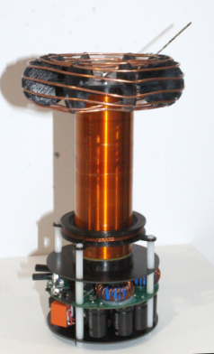
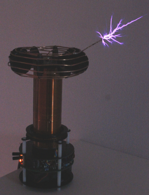
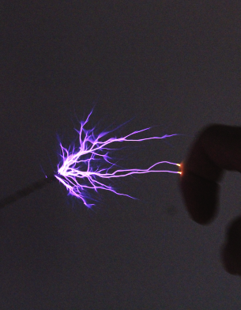
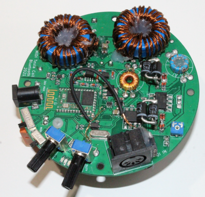
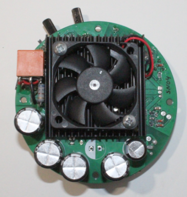
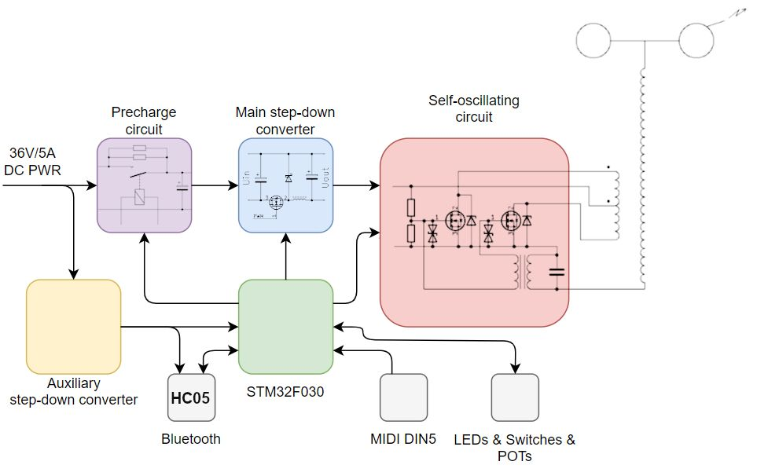
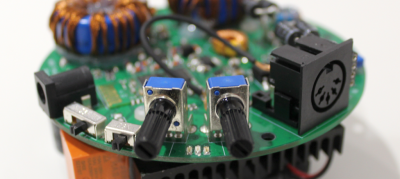

This project began as building a small solid-state Tesla coil just for fun. 
After being successfully used in CTU FEE presentations, a few more pieces have been built...

  

The SSTC uses an STM32F030 as the main controller. It controls the power voltage and enables/disables the power self-oscillating circuit. The STM32 performs MIDI note synthesis from two possible input sources: Bluetooth VCP and traditional 5-pin MIDI. This can be done in two ways: modulation of the power voltage by a buck converter (first mode - CW), and enabling/disabling the power oscillator in the rhythm of the played note (second mode - INT). In 'CW' mode, it is also possible to play multiple notes at once, while in interrupter mode, only one note can be played at a time. The disadvantage of CW mode is high power consumption, which causes power losses and overheating after a few minutes.

Bluetooth name: SSTC_SNxx (xx serial number)

Bluetooth PIN: 1856

For using a MIDI keyboard connected to a notebook via Bluetooth, the useful tool 'Hairless MIDI' is recommended: https://projectgus.github.io/hairless-midiserial/. It allows for a simple connection between the MIDI keyboard and the VCP created by Bluetooth. The number of the COM port assigned to the Bluetooth device can be found (on Windows) in Bluetooth settings -> Other settings for Bluetooth -> COM ports (outgoing port).

Since the keyboard is connected via USB and is susceptible to electromagnetic noise, the PC and keyboard should be placed at least 2-3 meters away from the Tesla coil to avoid interference.

For optimal spark performance, it is best to place the SSTC on the floor or on a grounded underlay.

**! CAUTIONS !**

**The Tesla coil is, for safety reasons, powered by an external 36V/5A SMPS, ensuring that no lethal voltage is present anywhere. However, there are two important exceptions to keep in mind!**

**The electric field intensity and magnetic induction near the Tesla coil are enormous, which can lead to the destruction of any nearby electronics (phones, PCs, watches, etc.).**
**Additionally, there is still a risk for humans, particularly for those with heart conditions, and even more so for individuals with pacemakers.**

**SSTCs, in general, do not tolerate ground strikes well (sparks hitting a grounded object or any object instead of the air). If you touch the ends of the sparks or about half of their length, it should be okay, but directly touching the toroid electrode with a screwdriver or a finger can, and most likely will, lead to the destruction of the Tesla coil.**

Video in action:

https://youtu.be/WxlvXRLJuSU

https://youtube.com/shorts/vosLOoO7MRc

While its electronics:

 

This SSTC has 2 switches for mode setting and 2 POTs for manual mode setting (freq 1-50 Hz and duty-cycle 0-15 % with 15 ms maximum pulse length).

3-way switch on left swithes between modes:

left: Interrupter based MIDI (single note)

mid:  Manual mode

right:CW modulated MIDI (max 4 notes at a time)

2-way switch on right:

left:  MIDI INPUT

right: BLUETOOTH INPUT

(for manual mode it also switches between POTs input and bluetooth input)

There are 3 LED indicators:

Green  - fast blinking: bluetooth ready to connect; slow blinking - bluetooth connected

Orange - sparks burst (power stage active)

Red    - overheating

